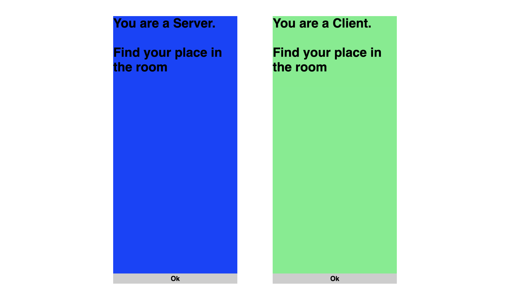
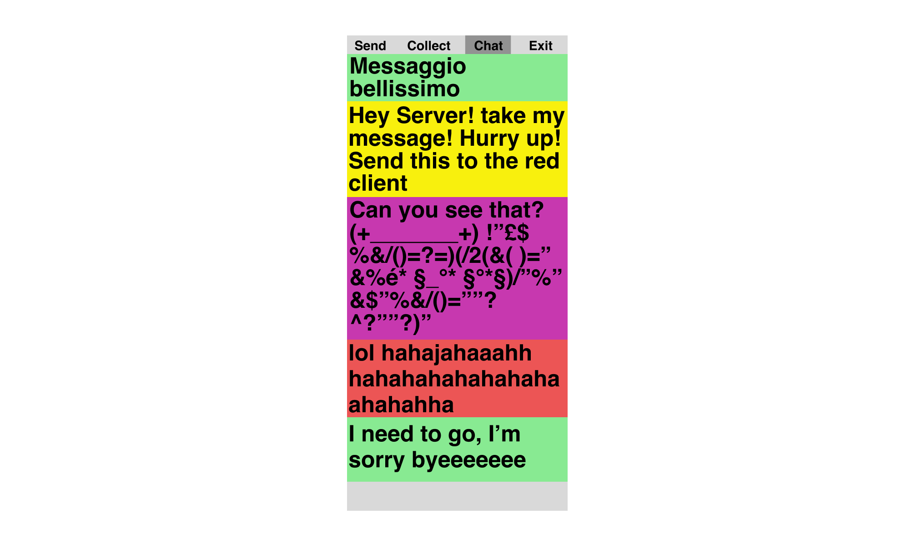

<p align="center">
  
</p>

### Table of Contents
1. [Project](#project) <br>
  1.1 [Concept](#concept) <br>
  1.2 [Technical requirements](#technical-requirements) <br>
  1.3 [Context of use](#context-of-use) <br>
3. [Structure](#structure) <br>
  2.1 [Welcome page](#welcome-page) <br>
  2.2 [Client or Server](#client-or-server) <br> 
  2.3 [Client's send page](#clients-send-page) <br>
  2.4 [Server's collect page](#servers-collect-page) <br>
  2.5 [Client's collect page](#clients-collect-page) <br>
  2.6 [Chat pages](#chat-pages) <br>
4. [Design challenges](#design-challenges) <br>
  3.1 [Communicating data exchange](#communicating-data-exchange) <br>
5. [Coding challenges](#coding-challenges) <br>
  4.1 [Server](#server) <br> 
  4.2 [Color recognition](#color-recognition) <br>
  4.3 [ASCII 3D shape](#ascii-3d-shape) <br> 
6. [Credits](#credits) <br>
7. [Team members](#team-members) <br>
8. [Course](#course) <br>


## Concept
This project wants to recreate a chat group in a physical space, in which people are the senders, the messengers and the receivers. This is a Client-Server simulation designed to discover in a simple way the interaction that we all use every day to communicate without perceiving it.
Clients are the requesters that users use to communicate with each other through the server which is the provider that brings the message from a client to another.
This experience aims to make more understandable to people what happens on a daily basis through messaging apps, but in general across all devices that use client and server interactions.
This project wants to recreate this type of intangible connection in a physical space by making it tangible, entrusting the sending and receiving of these messages to people.
The prototype makes people move along the intangible flows that would otherwise accomplish data in the Web. It wants to expose the path that data takes before it reaches its destination, demonstrating in actual how this technology works.

> "Invisible things are the ones taken for granted: we do not focus our attention on the hammer itself when we use it – we just use it” 
Hallnäs & Redström, 2002

### Technical requirements 
Five smartphones connected to the internet.

### Context of use
This exhibition is designed within a space for five people arranged in as many stations, characterized by colorful cardboards
Only one is the server and it is placed in the center, when a client writes and packages a message, the server is able to collect and deliver the package.
The other clients have to collect the package from the server and with that they will be able to read the message in the chat.

<br>

## Structure

### Welcome page
<p align="center">
  
</p>

In the welcome page there is a short slideshow explaining how the prototype works. <br>

### Client or Server
<p align="center">
  
</p>

The first participant who enters the room will become a server, the next four will become clients. <br>

### Client's send page
<p align="center">
  
</p>

Clients write and package messages and then wait for the server to pick them up.<br>

### Server's collect page


The Server frames the data package of the client with the phone camera in order to collect the message, then it shows the data package to all the other clients. <br>

### Client's collect page


Clients collect the data package from the server by scanning the data package.<br>

### Chat pages
<p align="center">
  
</p>

When a client collects the data, the message is finally displayed on the chat section.

<br>

## Design challenges

### Communicating data exchange

To make the client-server model more intuitive and easy to understand, we have reworked the steps that would have been handled automatically by the computer, turning them into tasks to be taken by participants:
-Clients write a message, package the data and ask the server to take it.
-Server finds the packaged data in a 3D ascii form and collects it with the scanner.
-Server transports the packaged data to other clients, which also collect it with their devices.
-Clients receive the response and see the message.

To show the data packages the texts entered by participants are associated with three-dimensional figures with varying sizes and characteristics depending on the text entered.
That graphic element represented well the packing of data and the hidden part of communication that happens after sending a message, that we normally don't know about.

To collect the message, the scanner relies on the color of the participant's screen and not the ASCII data package. Is a way we find and choose to identify clients that better suits the project rather than qr-code or other popular methods.


## Coding challenges

### Server

One of the main coding challenges consists in properly taking advantage of the socket.io library to make the user understand the complexity behind client/server connections.
As if that were not enough, we had to complicate a process that is normally completely managed by the computer, by creating a fake server on a client to expose how an actual chat works.To do this we have to check all the phases and recreate all  checkpoints that normally are auto-managed, adding different actions for each step and make the operation look real.
<br>

```
function newConnection(newSocket) {
  //global chat entra
  newSocket.on("chatConnected", function (chatId) {
    globalChat = chatId;
    io.emit("chat connected");
    console.log("nuova chat globale: " + chatId);
  });

  //controlla disponibilità di posti
  newSocket.on("checkAvailability", checkAvailability);

  //manda lista aggiornata a tutti appena entrano
  newSocket.on("requestUserUpdate", function () {
    io.emit("updateUsers", userArray);
    if (globalChat) {
      io.emit("chat connected");
    }
  });

  //manda disponibilità
  function checkAvailability() {
    for (i = 0; i < 5; i++) {
      if (userArray[i]) {
        console.log(i + " occupato");
      } else {
        console.log(i + " libero");
        io.to(newSocket.id).emit("placeAvailable", i);
      }
    }
  }

  //entra nella stanza e aggiorna array
  newSocket.on("enter-room", function () {
    for (let i = 0; true; i++) {
      if (typeof userArray[i] == "undefined") {
        userArray[i] = newSocket.id;
        console.log(userArray);
        io.emit("updateUsers", userArray);
        break;
      }
    }
  });

  //esce dalla stanza stanza e aggiorna array e chat
  newSocket.on("disconnect", function () {
    if (newSocket.id == globalChat) {
      console.log("chat disconnected");
      globalChat = undefined;
      io.emit("chat disconnected");
    }
```

### Color recognition
Creating a color recognizer that uses the camera is no big deal, the difficulty occurs when you have to recognize the color of a screen. On a technical level creating the final color scanner was a bit challenging. When capturing a screen with the camera, the colors are distorted according to the device display. We had to calibrate the color scanner to the perception of different devices by averaging the color codes in HSB (Hue, Saturation, Brightness) and adding a threshold.
 <br>

```
  targetColors.forEach(function (color) {
    let ratio = (100 * color.total) / (subW * subH);
    if (ratio >= 70) {
      if (color.name == "blue") {
        if (pendingServerMessage == true) {
          showMessage();
        }
      }
    }
  });

function RGBToHSL(r, g, b) {
  // Make r, g, and b fractions of 1
  r /= 255;
  g /= 255;
  b /= 255;

  // Find greatest and smallest channel values
  let cmin = Math.min(r, g, b),
    cmax = Math.max(r, g, b),
    delta = cmax - cmin;

  // Calculate hue
  // No difference
  if (delta == 0) hue = 0;
  // Red is max
  else if (cmax == r) hue = ((g - b) / delta) % 6;
  // Green is max
  else if (cmax == g) hue = (b - r) / delta + 2;
  // Blue is max
  else hue = (r - g) / delta + 4;

  hue = Math.round(hue * 60);

  // Make negative hues positive behind 360°
  if (hue < 0) hue += 360;

  // Calculate lightness
  lightness = (cmax + cmin) / 2;

  // Calculate saturation
  saturation = delta == 0 ? 0 : delta / (1 - Math.abs(2 * lightness - 1));

  // Multiply l and s by 100
  saturation = +(saturation * 100).toFixed(1);
  lightness = +(lightness * 100).toFixed(1);
}

function findAverageColor() {
  let totalHue = 0;
  let totalSat = 0;
  let totalLig = 0;

  for (let i = 0; i < avgHueArray.length; i++) {
    totalHue += avgHueArray[i];
    totalSat += avgSatArray[i];
    totalLig += avgLigArray[i];
  }

```

### ASCII 3d shape 

The challenge with the Ascii was to learn a new library, which needs to be linked to collaborate with external scripts, and it’s based on type modules. 
Another thing to take into consideration was the handling of the canvas so that the object remains fixed and destroys it if another message is sent. 
Finally, since Ascii code was applied to a three-dimensional figure, it was necessary to manage the camera and lighting settings to get a better result.
  <br>

```
function getmydata() {
  myMessage = document.getElementById("message-input").value;
  console.log("lettere: " + myMessage.length);
  nParole = myMessage.split(" ").length;
  let facce = Math.round(map_range(nParole, 1, 10, 0, 5));
  console.log("parole: " + nParole);

  radiusArr.push(myMessage.length * 10);
  radius = radiusArr[radiusArr.length - 1];
  let raggio = Math.round(map_range(myMessage.length, 0, 140, 120, 600));

  sphere = new THREE.Mesh(
    new THREE.TetrahedronGeometry(raggio, facce),
    new THREE.MeshPhongMaterial({ color: "green", flatShading: true })
  );
  sphere.name = "sphere";
  sphere.receiveShadow = true;
  sphere.castShadow = true;
  scene.add(sphere);

  if (radius < radiusArr[radiusArr.length - 2]) {
    a += 1;

    document
      .getElementById("ascicanvas")
      .removeChild(effect[a - 1].domElement);
    init();

    sphere = new THREE.Mesh(
      new THREE.TetrahedronGeometry(raggio, facce),
      new THREE.MeshPhongMaterial({ color: "green", flatShading: true })
    );
    sphere.name = "sphere";
    sphere.castShadow = true;
    scene.add(sphere);
  }
  console.log(sphere.position);
  console.log(camera.position);
}

init();
animate();

function init() {
  camera = new THREE.PerspectiveCamera(
    100,
    window.innerWidth / window.innerHeight,
    1,
    1000
  );
```

## Credits
[P5js](https://p5js.org/) -
P5 JavaScript library was used to develop the WebApp. <br>
[Three.js](https://https://threejs.org/) -
Three JavaScript library was used to create e manipulate 3D shape. <br>
[Socket.io](https://socket.io/) -
Socket.io was used to create a server. <br>


## Team members
Federico Bobbo<br>
Francesco Bonetti<br> 
Sarah Cosentino<br> 
Matteo dell’Agostino<br>
Enrico Isidori


## Course
[Creative Coding 2022/2023](https://drawwithcode.github.io/) <br>
**Politecnico di Milano** - Scuola del Design - Communication Design <br>
**Faculty:** Michele Mauri, Andrea Benedetti, Tommaso Elli <br>
